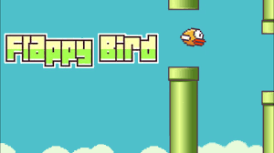

# Procedural Themed Flappy Bird with RL Agents

This repository contains a modular, procedurally generated version of Flappy Bird with multiple themes and reinforcement learning (RL) agent support.

## Table of Contents

- [Overview](#overview)
- [Requirements](#requirements)
- [Game Structure](#game-structure)
- [How to Run](#usage)
  - [1: Manual Play](#manual-play)
  - [2: Agent Play](#agent-play)
- [Themes and Procedural Content](#themes-and-pcg)
- [Project Structure](#project-structure)
- [Notes](#notes)

## Overview

This project extends the classic Flappy Bird into a flexible simulation environment, integrating:

- Procedural content generation (PCG) via predefined pipe patterns

- Dynamic theme transitions ("day", "night", "hell", "space")

- Multi-mode support: manual or RL agent-controlled gameplay

- Reinforcement learning agents including PPO and Double DQN

- Implemented in Python using the pygame library, this system is designed to evaluate gameplay adaptation across varying difficulty and visual themes.

## Requirements

- Python 3.8+
- [Pygame](https://www.pygame.org)
- [NumPy](https://numpy.org/)
- torch

You can install the required packages via pip:

```bash
pip install -r requirements.txt
```

## Game Structure

### Manual Play
```bash
  python main.py
```

Controls:
- SPACE: Make the bird jump
- R: Restart the game after death

### Agent Play
```bash
  python agent_plays_game.py --model 1
```

Available Agents: (PPO, DDQN, DQN, SAC)

PPO
```bash
  --model 1 
```

DDQN
```bash
  --model 2 
```

DQN
```bash
  --model 3 
```

SAC
```bash
  --model 4 
```

## Themes and Procedural Content

The game dynamically switches between themes every few pipe intervals:

- Each theme changes background, ground, pipe style, and ambient sound.

- Procedural pipe patterns (zigzag, wave, etc.) are loaded with spacing and difficulty multipliers.

- Customizable via the PIPE_PATTERNS dictionary in settings.py

This PCG system allows testing agent generalization across aesthetic and gameplay variations.

## Project Structure
```bash
.
├── main.py                # Manual play entry point
├── agent_plays_game.py    # RL agent play script
├── world.py               # Core game loop and state manager
├── bird.py                # Bird sprite and behavior
├── pipe.py                # Pipe sprite and logic
├── theme.py               # Theme manager class
├── game.py                # Score/level indicator renderer
├── settings.py            # Configs, constants, PCG pipe patterns
├── ppo_agent.py           # PPO agent class
├── Ddqn_agent.py          # DDQN agent class
├── memory.py              # Replay buffer
├── sound.py               # Sound effects
├── assets/                # Images and sounds by theme
├── models/                # Saved agents
└── requirements.txt       # Python dependencies
```

## Notes

- RL agents are trained per theme for better generalization.
 
- The PPO agent uses Categorical policies and requires eval mode for inference.

- Manual and agent play use a shared World class for consistency.

- Agent step() and reset() methods follow RL API conventions.

- PCG and theme switching logic can be tuned in world.py

- Have fun experimenting with Flappy RL in space, hell, and beyond!